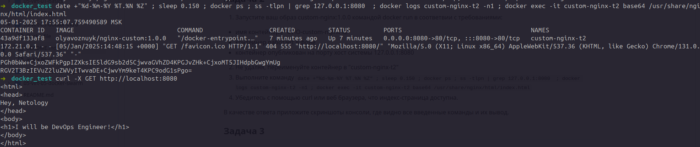
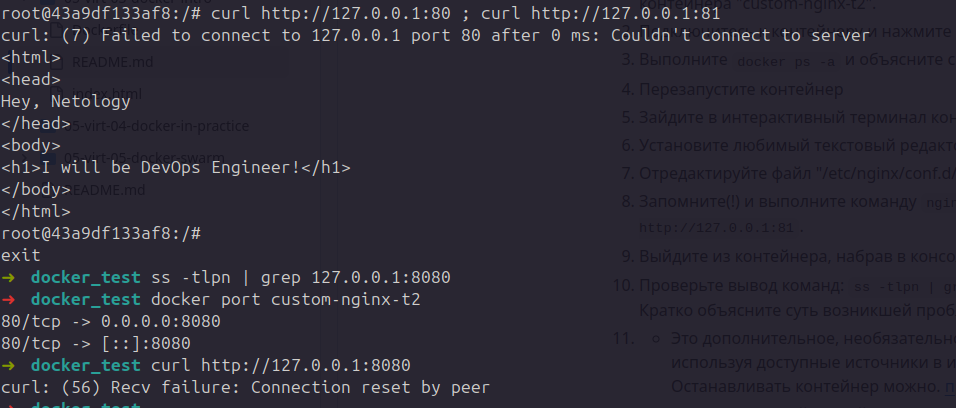
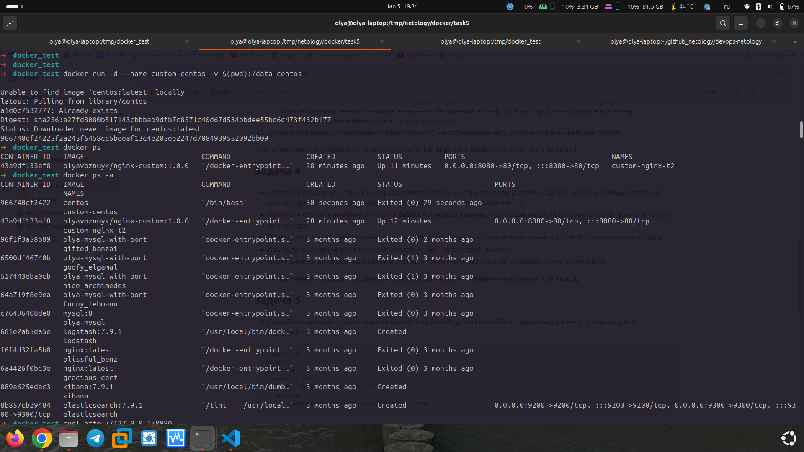
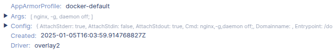

## Домашнее задание к занятию 4 «Оркестрация группой Docker контейнеров на примере Docker Compose»
### Задание 1

[Docker hub](https://hub.docker.com/r/olyavoznuyk/netology-education/tags)

### Задание 2



### Задание 3



> происходит ошибка из-за того, что при запуске `docker container` пробрасывается порт `80`, но в настройках `nginx` слушается порт `81`

### Задание 4



### Задание 5

* содержимое консоли

```
➜  task5 docker compose up -d
WARN[0000] Found multiple config files with supported names: /tmp/netology/docker/task5/compose.yaml, /tmp/netology/docker/task5/docker-compose.yaml 
WARN[0000] Using /tmp/netology/docker/task5/compose.yaml 
WARN[0000] Found multiple config files with supported names: /tmp/netology/docker/task5/compose.yaml, /tmp/netology/docker/task5/docker-compose.yaml 
WARN[0000] Using /tmp/netology/docker/task5/compose.yaml 
[+] Running 12/12
 ✔ portainer 11 layers [⣿⣿⣿⣿⣿⣿⣿⣿⣿⣿⣿]      0B/0B      Pulled                                                                                                                             40.1s 
   ✔ dc8df0f2921e Pull complete                                                                                                                                                          1.3s 
   ✔ c82aa9c9fb45 Pull complete                                                                                                                                                          1.3s 
   ✔ d40df14c1d7a Pull complete                                                                                                                                                          9.3s 
   ✔ a3939f2dc487 Pull complete                                                                                                                                                         22.4s 
   ✔ 204b2fbb824e Pull complete                                                                                                                                                         22.7s 
   ✔ a53c840f28bf Pull complete                                                                                                                                                         29.6s 
   ✔ 9e1dadc4be73 Pull complete                                                                                                                                                         29.6s 
   ✔ 6f01ec19fa2b Pull complete                                                                                                                                                         33.6s 
   ✔ e2f767fe3885 Pull complete                                                                                                                                                         33.8s 
   ✔ 793e77bf062e Pull complete                                                                                                                                                         33.8s 
   ✔ 4f4fb700ef54 Pull complete                                                                                                                                                         33.8s 
[+] Building 0.0s (0/0)                                                                                                                                                                       
[+] Running 1/1
 ✔ Container task5-portainer-1  Started                                                                                                                                                  0.3s 
➜  task5 docker ps
CONTAINER ID   IMAGE                           COMMAND        CREATED          STATUS          PORTS     NAMES
7ee7766a8144   portainer/portainer-ce:latest   "/portainer"   23 seconds ago   Up 22 seconds             task5-portainer-1
5ea81ee73a7c   debian                          "sleep 3600"   28 minutes ago   Up 28 minutes             custom-debian
77a3682303b5   centos                          "sleep 3600"   29 minutes ago   Up 29 minutes             custom-centos
➜  task5 nano compose.yaml       
➜  task5 docker compose up -d
WARN[0000] Found multiple config files with supported names: /tmp/netology/docker/task5/compose.yaml, /tmp/netology/docker/task5/docker-compose.yaml 
WARN[0000] Using /tmp/netology/docker/task5/compose.yaml 
WARN[0000] Found multiple config files with supported names: /tmp/netology/docker/task5/compose.yaml, /tmp/netology/docker/task5/docker-compose.yaml 
WARN[0000] Using /tmp/netology/docker/task5/compose.yaml 
validating /tmp/netology/docker/task5/compose.yaml: (root) Additional property include is not allowed
➜  task5 nano compose.yaml   
➜  task5 docker compose up -d
WARN[0000] Found multiple config files with supported names: /tmp/netology/docker/task5/compose.yaml, /tmp/netology/docker/task5/docker-compose.yaml 
WARN[0000] Using /tmp/netology/docker/task5/compose.yaml 
WARN[0000] Found multiple config files with supported names: /tmp/netology/docker/task5/compose.yaml, /tmp/netology/docker/task5/docker-compose.yaml 
WARN[0000] Using /tmp/netology/docker/task5/compose.yaml 
[+] Running 6/6
 ✔ registry 5 layers [⣿⣿⣿⣿⣿]      0B/0B      Pulled                                                                                                                                     13.5s 
   ✔ dc0decf4841d Pull complete                                                                                                                                                          3.4s 
   ✔ 6cb0aa443e23 Pull complete                                                                                                                                                          3.5s 
   ✔ 813676e291ef Pull complete                                                                                                                                                          7.4s 
   ✔ dc2fb7dcec61 Pull complete                                                                                                                                                          7.4s 
   ✔ 916205650bfe Pull complete                                                                                                                                                          7.4s 
[+] Building 0.0s (0/0)                                                                                                                                                                       
[+] Running 3/3
 ✔ Network task5_default        Created                                                                                                                                                  0.1s 
 ✔ Container task5-registry-1   Started                                                                                                                                                  0.3s 
 ✔ Container task5-portainer-1  Running                                                                                                                                                  0.0s 
➜  task5 docker tag custom-nginx localhost:5000/custom-nginx:latest

Error response from daemon: No such image: custom-nginx:latest
➜  task5 docker tag olyavoznuyk/nginx-custom:1.0.0 localhost:5000/custom-nginx:latest 

➜  task5 docker push localhost:5000/custom-nginx:latest

The push refers to repository [localhost:5000/custom-nginx]
6814d8b2e1c7: Pushed 
3f6a3d22b9ce: Pushed 
261a5dc153b4: Pushed 
7da4ba4a0030: Pushed 
10988c108f66: Pushed 
d58e4a0f2971: Pushed 
37719940dcaa: Pushed 
5d4427064ecc: Pushed 
latest: digest: sha256:8df8d75e284e1019f24c094c3d74cd03be43ddc828aafbc98763407ee026416d size: 1985
➜  task5 docker ps
CONTAINER ID   IMAGE                           COMMAND                  CREATED          STATUS          PORTS                                       NAMES
6e8f391b6bb4   registry:2                      "/entrypoint.sh /etc…"   2 minutes ago    Up 2 minutes    0.0.0.0:5000->5000/tcp, :::5000->5000/tcp   task5-registry-1
7ee7766a8144   portainer/portainer-ce:latest   "/portainer"             8 minutes ago    Up 8 minutes                                                task5-portainer-1
5ea81ee73a7c   debian                          "sleep 3600"             36 minutes ago   Up 36 minutes                                               custom-debian
77a3682303b5   centos                          "sleep 3600"             37 minutes ago   Up 37 minutes                                               custom-centos
➜  task5 nano compose.yaml                                                           
➜  task5 docker compose up -d                                                        
WARN[0000] Found multiple config files with supported names: /tmp/netology/docker/task5/compose.yaml, /tmp/netology/docker/task5/docker-compose.yaml 
WARN[0000] Using /tmp/netology/docker/task5/compose.yaml 
WARN[0000] Found multiple config files with supported names: /tmp/netology/docker/task5/compose.yaml, /tmp/netology/docker/task5/docker-compose.yaml 
WARN[0000] Using /tmp/netology/docker/task5/compose.yaml 
[+] Building 0.0s (0/0)                                                                                                                                                                       
[+] Running 3/3
 ✔ Container task5-registry-1                                           Running                                                                                                          0.0s 
 ✔ Container task5-portainer-1                                          Started                                                                                                          0.3s 
 ! portainer Published ports are discarded when using host network mode                                                                                                                  0.0s 
➜  task5 docker ps           
CONTAINER ID   IMAGE                           COMMAND                  CREATED          STATUS          PORTS                                       NAMES
d21fd1056a6e   portainer/portainer-ce:latest   "/portainer"             17 seconds ago   Up 17 seconds                                               task5-portainer-1
6e8f391b6bb4   registry:2                      "/entrypoint.sh /etc…"   3 minutes ago    Up 3 minutes    0.0.0.0:5000->5000/tcp, :::5000->5000/tcp   task5-registry-1
5ea81ee73a7c   debian                          "sleep 3600"             37 minutes ago   Up 37 minutes                                               custom-debian
77a3682303b5   centos                          "sleep 3600"             38 minutes ago   Up 38 minutes                                               custom-centos
➜  task5 nano compose.yaml   
➜  task5 nano compose.yaml   
➜  task5 docker compose up -d 
WARN[0000] Found multiple config files with supported names: /tmp/netology/docker/task5/compose.yaml, /tmp/netology/docker/task5/docker-compose.yaml 
WARN[0000] Using /tmp/netology/docker/task5/compose.yaml 
WARN[0000] Found multiple config files with supported names: /tmp/netology/docker/task5/compose.yaml, /tmp/netology/docker/task5/docker-compose.yaml 
WARN[0000] Using /tmp/netology/docker/task5/compose.yaml 
[+] Building 0.0s (0/0)                                                                                                                                                                       
[+] Running 2/2
 ✔ Container task5-registry-1   Running                                                                                                                                                  0.0s 
 ✔ Container task5-portainer-1  Started                                                                                                                                                  0.3s 
➜  task5 docker ps 
CONTAINER ID   IMAGE                           COMMAND                  CREATED          STATUS          PORTS                                                           NAMES
842dfc896655   portainer/portainer-ce:latest   "/portainer"             3 seconds ago    Up 2 seconds    8000/tcp, 9443/tcp, 0.0.0.0:9000->9000/tcp, :::9000->9000/tcp   task5-portainer-1
6e8f391b6bb4   registry:2                      "/entrypoint.sh /etc…"   6 minutes ago    Up 6 minutes    0.0.0.0:5000->5000/tcp, :::5000->5000/tcp                       task5-registry-1
5ea81ee73a7c   debian                          "sleep 3600"             40 minutes ago   Up 40 minutes                                                                   custom-debian
77a3682303b5   centos                          "sleep 3600"             41 minutes ago   Up 41 minutes                                                                   custom-centos
➜  task5 
```

* содержимое файла `compose.yaml`

```
➜  task5 cat /tmp/netology/docker/task5/compose.yaml 
version: "3"
services:
  portainer:
    #network_mode: host
    image: portainer/portainer-ce:latest
    ports:
      - "9000:9000"
    volumes:
      - /var/run/docker.sock:/var/run/docker.sock

  registry:
    image: registry:2
    ports:
      - "5000:5000"
```

> так как в версии `3` не поддерживается директива `include` файл сшивается вместе через `services`

* скриншот `portainer`


